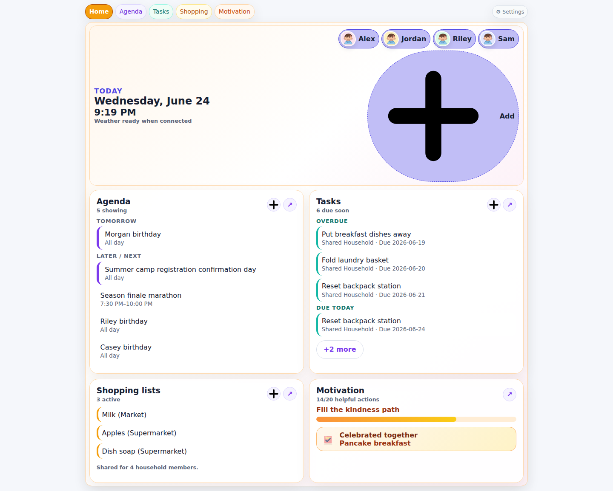
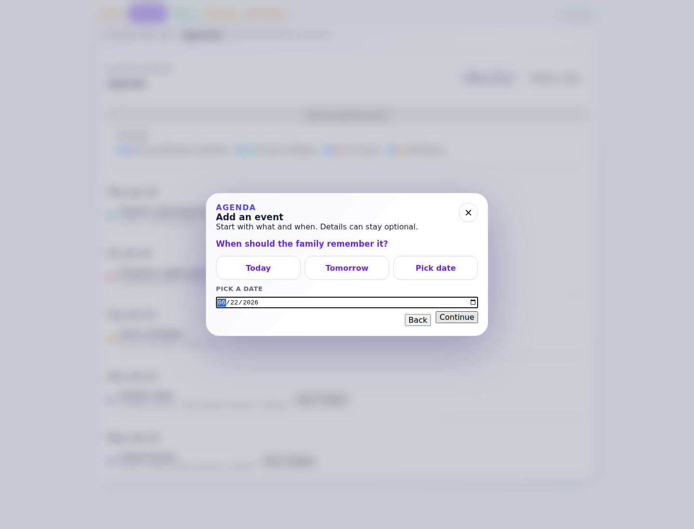
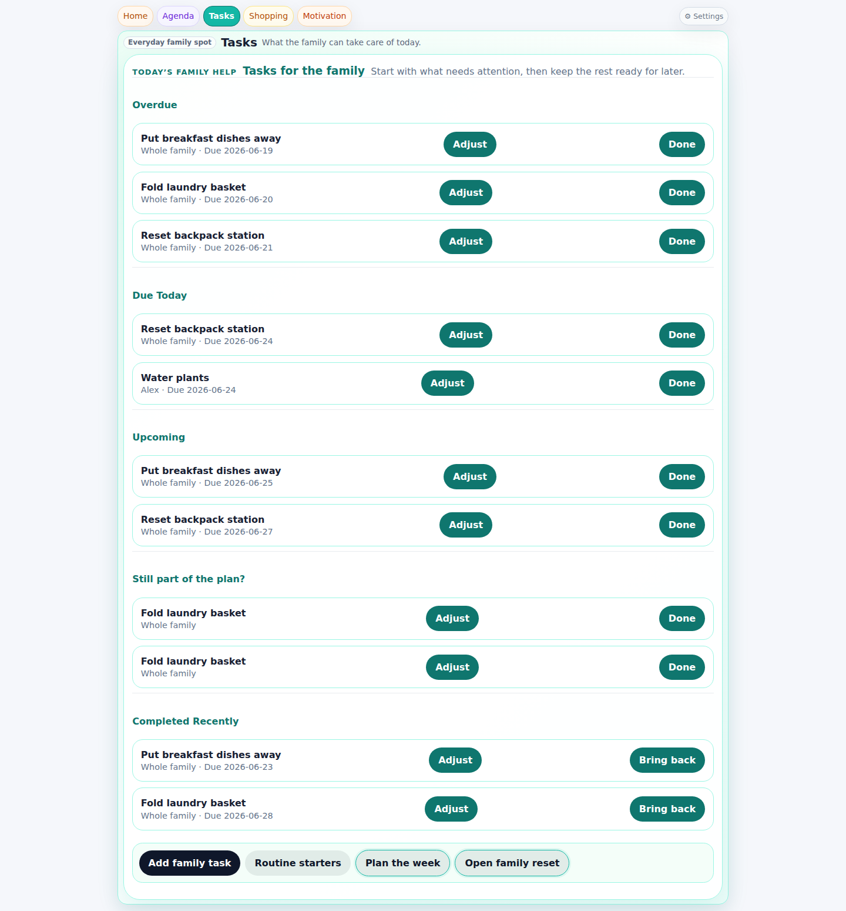
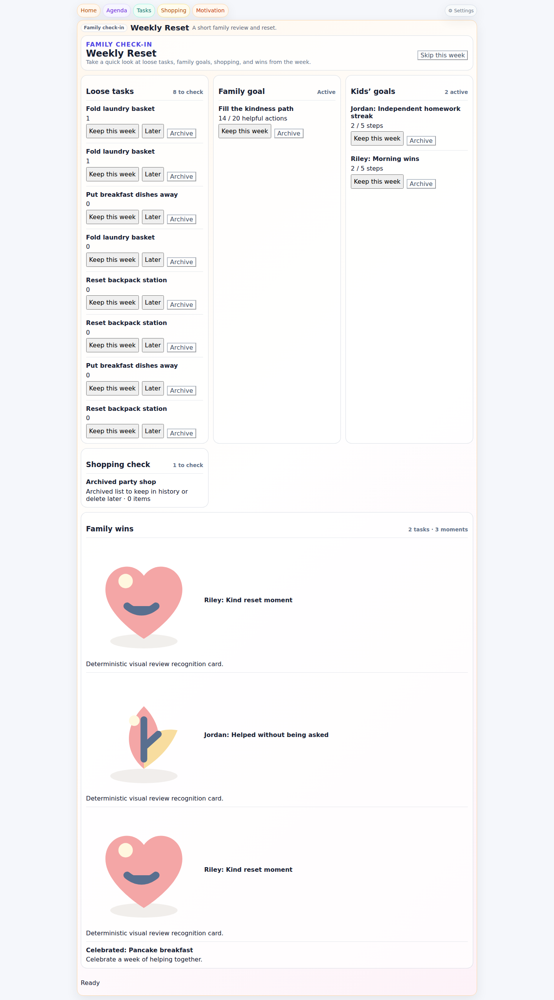
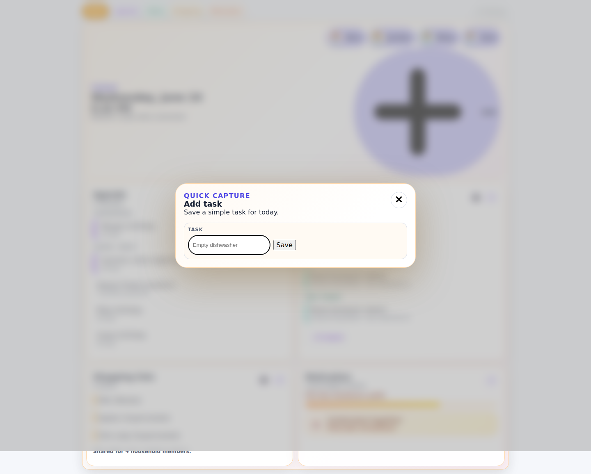
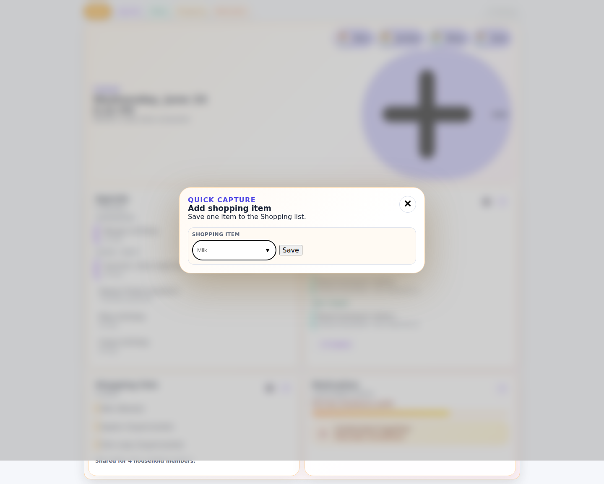
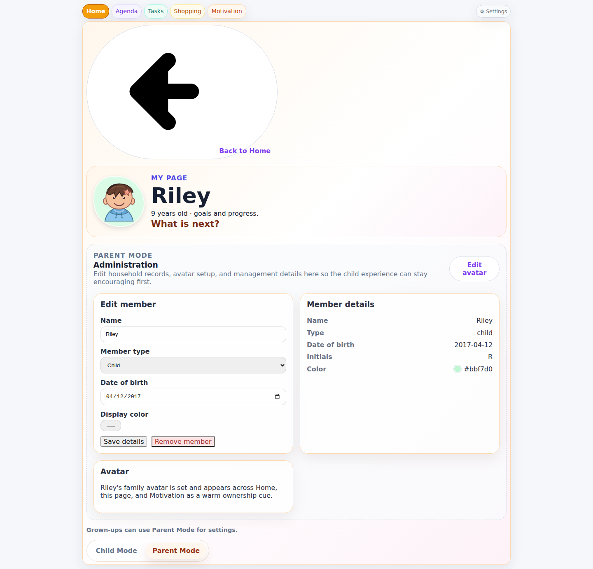
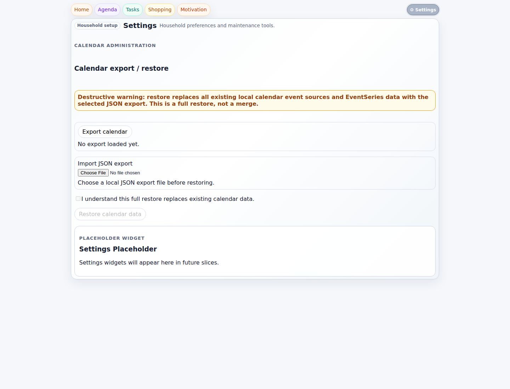

# Executive Summary

HomeOps now mostly feels like a family product.

The strongest parts of the product are Home, Motivation, Helpful Moments, the child-facing family member page, and the best conversational dialogs. Those areas share a soft emotional tone, rounded/pastel surfaces, encouraging copy, and a sense that the app is about family life rather than household administration.

The remaining coherence gaps are concentrated in Shopping, Settings, Parent Mode / adult member management, and the quick-capture dialogs on Home. Those areas still feel more like utilities or administration software than like the same warm family product.

Onboarding was not interactively accessible in the seeded review state because the visual review fixture loads into a completed household.

# Overall Product Impression

The application has clearly moved away from an admin-first tool. The default feeling is now softer, friendlier, and more relationship-oriented. The visual language is recognizably shared across the product: rounded cards, pastel accents, light borders, blurred dialog backdrop, and compact header actions.

It is not fully unified yet. The product currently feels like:
- a strong family-facing core
- wrapped around a few remaining management-style surfaces

Profile management in the current build is effectively handled through Family Member pages and Parent Mode rather than through a separate user-account profile surface.

That means the emotional promise is real, but still interrupted by some pages and workflows that revert to operational language, inline control clusters, and conventional forms.

# Home Review

Home is now much closer to a true dashboard than a landing page with stacked feature sections.

What works well:
- The 2x2 summary layout makes Home feel like an overview surface.
- Agenda, Tasks, Motivation, and Shopping each answer a quick daily question.
- Compact card actions keep the page lighter than the previous admin-like pattern.
- Family member pills reinforce household identity immediately.
- The overall tone is calm and domestic rather than corporate.

What still weakens Home:
- The oversized Add family member control dominates the hero area visually and competes with the dashboard content.
- The top panel still feels compositionally uneven: the left side is calm status copy, while the right side is mostly one giant utility action.
- The quick-capture dialogs are useful, but they are still utility micro-forms rather than part of the conversational interaction language.
- The Home summary cards feel more coherent than the hero area itself.

Verdict: Home now reads as a dashboard, but the hero composition still has one strong leftover utility-shaped interruption.

# Dialog Consistency Review

## Strong matches to the intended interaction language

### Tasks create/edit
This is the clearest reference implementation.
- One question at a time
- Progressive disclosure
- Friendly wording
- Useful shortcuts
- Review summary before save

It feels warm, simple, and rhythmically consistent.

### Family Goal create/edit
This is also strong.
- Title -> progress -> celebration -> review
- Good emotional framing
- Friendly future-oriented language
- Clear sense of family celebration

This is one of the best examples of the new HomeOps voice.

### Helpful Moments
Also strong.
- Person -> moment -> tag -> note -> review
- Warmest emotional tone in the product
- Reinforces appreciation and identity well

This dialog strongly supports the family-first transformation.

### Agenda create/edit
Mostly aligned.
- Still question-based
- Starts with what and when
- Uses progressive disclosure
- Keeps details optional

It is not as emotionally rich as Tasks or Helpful Moments, but it fits the system.

## Partial matches / weaker fits

### Home quick-capture dialogs
These are the weakest dialog family.
- Add event from Home
- Add task from Home
- Add shopping item from Home

They visually match the rounded pastel dialog language, but behaviorally they revert to tiny utility forms. They do not feel like the same conversation pattern as Task create/edit.

### Add family member
This dialog is visually aligned, but structurally it is still a standard form:
- Name
- Member type
- Date of birth
- Display color

It feels functional, not conversational.

### Personal goal create/edit
This is the clearest form-style outlier inside Motivation.
It is compact and serviceable, but it does not use the one-question rhythm. It feels more like a settings form than a family conversation.

### Avatar editor
The avatar editor is intentionally tool-like. That is acceptable, but it is still a configuration surface, not a conversation. It belongs to setup rather than daily family interaction.

# Family Identity Review

Strong family identity:
- Home
- Motivation
- Helpful Moments
- Child Mode member page
- Family Goal flow
- Celebration/memory surfaces
- Weekly Reset concept

Weak or broken family identity:
- Shopping page
- Settings page
- Parent Mode member management
- Adult member page administration section
- Source toggles and edit/delete clusters in Agenda

The biggest pattern is this: anywhere HomeOps is celebrating, appreciating, or coordinating together, it feels like a family product. Anywhere it is managing records, stores, imports, deletes, or admin controls, it slides back toward administration software.

# Visual Consistency

## What is coherent
- Rounded navigation pills and soft cards create a recognizable brand shape language.
- Dialog backdrop blur works well and supports the new emotional tone.
- Pastel tints and warm off-white surfaces make the product feel domestic and approachable.
- The Home summary cards create a strong overview system.
- Motivation surfaces are especially cohesive and polished.

## What is inconsistent
- Surface rounding varies noticeably across the app. Cards and panels use visibly different radii, which makes the system feel slightly improvised rather than tightly tokenized.
- Some surfaces still render as flatter utility sections while others look fully carded and intentional.
- Shopping and parts of Tasks rely more on list rows and repetitive action buttons than on the softer, more composed card language.
- Settings contains placeholder/product-internal language that breaks polish.
- "Widget" and "Placeholder" naming is still visible in user-facing copy and weakens the illusion of a finished consumer product.

# Interaction Consistency

Best rhythm:
- Tasks
- Family Goal
- Helpful Moments

Acceptable but slightly less expressive:
- Agenda

Noticeably inconsistent:
- Personal goals
- Add family member
- Home quick capture
- Shopping
- Parent Mode
- Settings

The intended rhythm is:
Question -> choice -> question -> choice -> review

That rhythm is present in the strongest family dialogs, but not yet product-wide. Several workflows still behave like direct-entry forms or management panels.

# Navigation Review

What works:
- Primary navigation is short and easy to scan.
- Everyday areas are clearly separated from Settings.
- Weekly Reset being contextual from Tasks is sensible.
- Family member entry from Home reinforces that people are central.

What is less successful:
- Family Members are discoverable from Home, but not from the primary navigation. That makes the area feel important emotionally but secondary structurally.
- Agenda, Tasks, Motivation, and Shopping each have their own local action patterns, so action placement is not fully standardized.
- Home duplicates action entry points through both card actions and destination pages.
- Settings is visually tucked away, but once opened it becomes a hard tonal shift.

# Dashboard Review

Home now feels more like a dashboard than a collection of independent pages.

Why it works:
- It summarizes four household domains without forcing detail first.
- It uses small glances instead of full workflows.
- It orients the household around today, family members, and shared momentum.

Why it is not fully finished:
- The hero panel is still not doing enough dashboard work relative to its size.
- The giant Add control is visually louder than the family overview itself.
- The top section feels like a partially transformed legacy composition, while the lower 2x2 summary grid feels fully aligned.

# Top 10 UX Improvements

1. Replace the oversized Add family member hero action with a smaller, calmer family-summary treatment.
2. Convert Home quick-capture dialogs into the same conversational pattern used by Task create/edit.
3. Rework Shopping from an inline utility widget into a softer guided family list experience.
4. Redesign Personal Goal create/edit to match the family conversation rhythm instead of a compact form.
5. Soften Parent Mode and adult member management so it feels like household setup, not administration.
6. Remove user-facing "Widget" and "Placeholder" language from surfaced UI copy.
7. Make Settings feel less like an admin console and more like a calm household maintenance area.
8. Reduce repeated inline action buttons in Tasks and Weekly Reset where rows start to feel operational.
9. Standardize surface radius and card treatment more tightly across dashboard cards, widgets, setup panels, and dialogs.
10. Make Family Members easier to discover as a first-class product area beyond the Home hero strip.

# Screenshots

1. Home dashboard: `screenshots/home-dashboard.png`
2. Agenda conversational dialog: `screenshots/agenda-dialog.png`
3. Task conversational dialog: `screenshots/task-dialog.png`
4. Weekly Reset review surface: `screenshots/weekly-reset.png`
5. Home task quick capture: `screenshots/home-task-capture.png`
6. Home shopping quick capture: `screenshots/home-shopping-capture.png`
7. Family member Parent Mode: `screenshots/family-member-parent-mode.png`
8. Settings: `screenshots/settings.png`

# Final Verdict

## Does HomeOps now feel like a family product?
Yes, mostly.

## Does it feel coherent?
Mostly, but not completely. The family-facing core is coherent; the management/setup surfaces are not yet at the same level.

## Does any page still feel like enterprise software?
Yes.
The clearest examples are Shopping, Settings, and Parent Mode / adult member management. Those surfaces still lean on operational language, direct-entry forms, and management controls.

## What is the single highest-impact UX improvement remaining?
Bring every remaining create/edit/setup flow into the same conversational interaction pattern as the Task dialog.

That one change would do the most to unify tone, rhythm, and emotional experience across the whole product.
