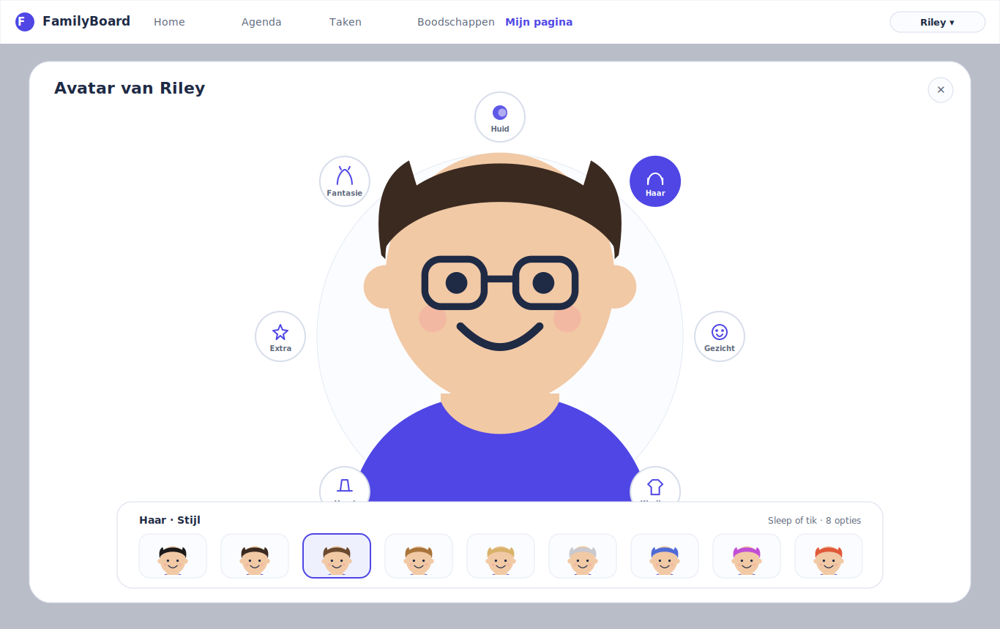
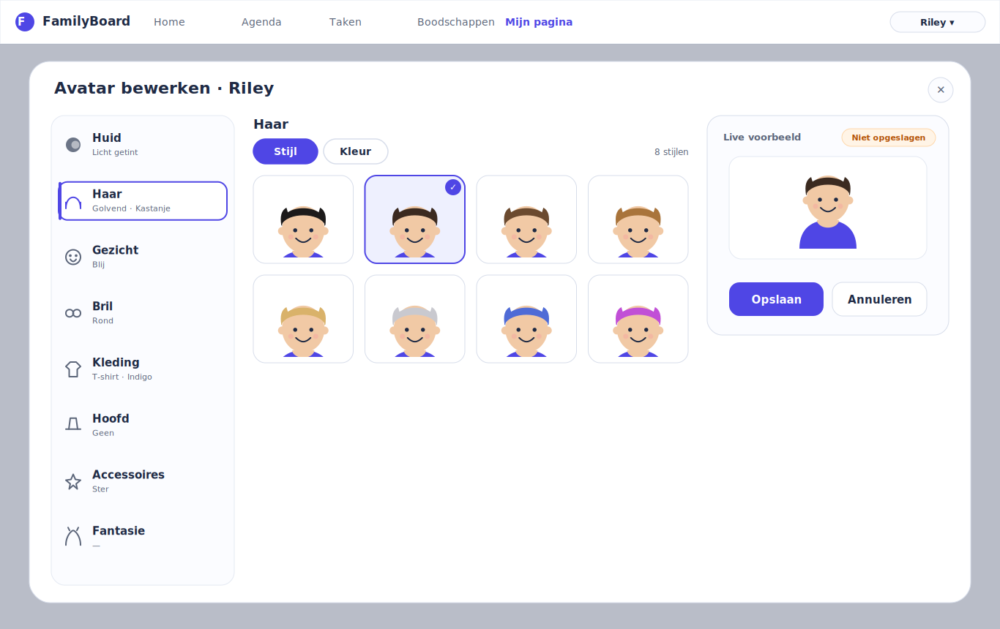
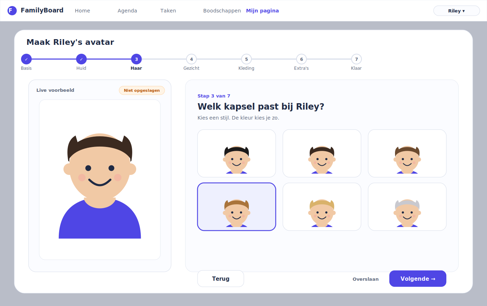
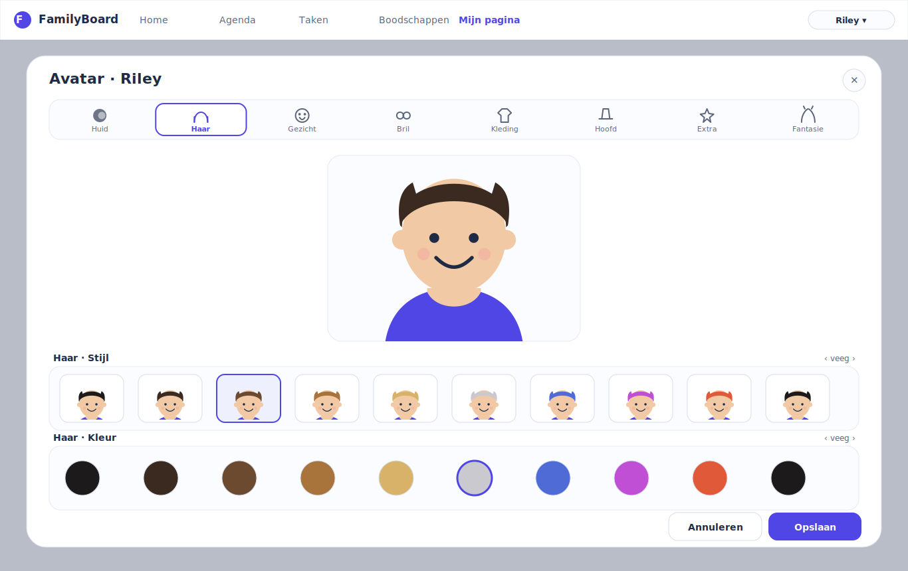
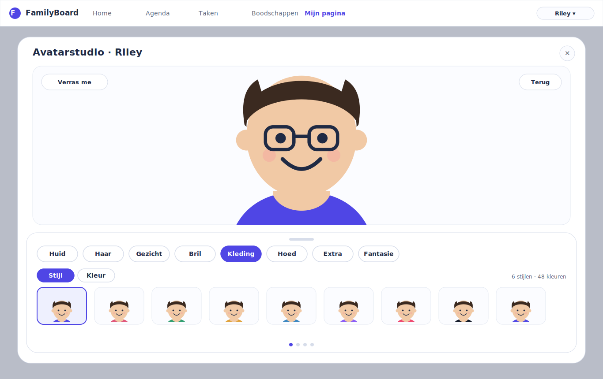
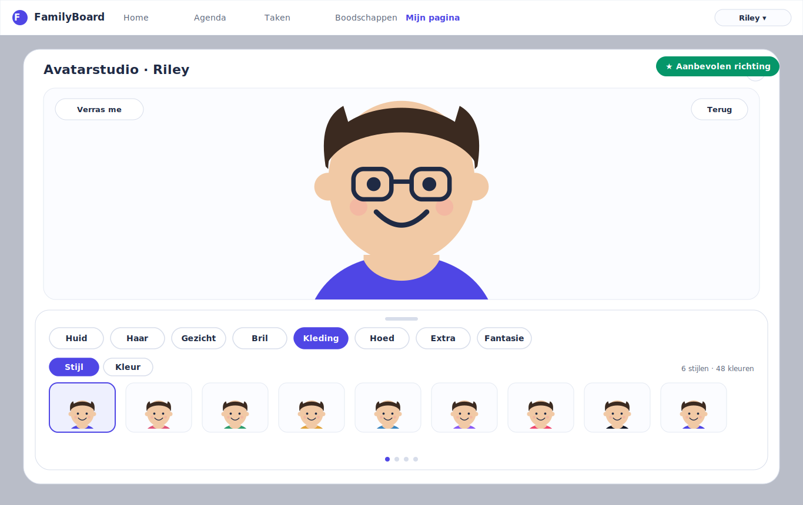

# Avatar Editor V4 — UX Exploration

_Date: 2026-07-10_

> **This is a UX exploration only.** No code was changed, no avatar assets were
> produced, and the avatar architecture (catalog, renderer, adapter,
> persistence, SVG system) is treated purely as a fixed technical constraint.
> The deliverable is this report plus the high-fidelity desktop mockups in
> [`mockups/`](./mockups). The report is intended to be the design foundation
> for a future Avatar Editor V4 implementation slice.

---

## 1. Executive Summary

The Avatar Editor V3 redesign was a real step forward: it introduced a
catalog-driven, two-level navigation model (a visual **category rail** — Huid,
Haar, Gezicht, Kleding, Accessoires — with per-category **attribute sub-tabs**
such as _Stijl_ / _Kleur_) that shows exactly one internally-scrolling option
grid while a large live preview stays permanently visible. Architecturally it is
sound and it already tolerates dozens of options per category.

But V3 was asked to answer a scaling question, and it answered it with a
_navigation_ pattern rather than a fully reconsidered _interaction_ model. Before
the catalog grows to the target scale (40+ hairstyles, 60+ hair colors, 40+
clothing styles, 80+ clothing colors, plus glasses, hats, masks, facial hair,
accessories, fantasy and seasonal content), we should validate whether the
interaction model itself is the best possible long-term solution — not just
whether the current one can be stretched.

This document:

- Reviews the **existing system** as an immovable technical constraint.
- Summarises **research** into nine best-in-class avatar editors and distils
  what each does exceptionally well and where each becomes cumbersome.
- Presents **five fundamentally different interaction models** (not five
  cosmetic variations), each with a distinct philosophy, complete IA,
  navigation model, interaction flow, and a full evaluation.
- Provides a **high-fidelity FamilyBoard desktop mockup** for every concept.
- Runs a **comparative analysis** across nine dimensions.
- Makes a single, critical **recommendation**, explains why the other four were
  rejected, names the remaining compromises, and lays out a **future evolution
  roadmap**.

**Recommendation in one line.** Adopt **Concept E — the Adaptive Studio
(persistent hero preview + docked category bar + paged option surface)**. It
keeps the preview central and permanently large, collapses navigation to a
single always-visible category bar (no nested rail-then-tab hop), turns the
option area into a bounded, paged surface that scales to hundreds of items
without ever growing the page, and — critically — is the _only_ concept whose
desktop layout and its touch/tablet layout are the **same information
architecture** rather than two designs bolted together. It is deliberately **not**
the closest concept to V3 (that is Concept B); V3's biggest latent cost is the
two-hop "pick a category, then pick an attribute" navigation, and the Adaptive
Studio removes that hop.

---

## 2. Existing System Review (Technical Constraints)

These are the parts of the system a V4 editor **must** reuse unchanged. They
constrain the UX; they do not define it.

### 2.1 Catalog is the source of truth

The canonical catalog lives in `src/shared/avatar-catalog.json` and is consumed
by the frontend (`src/HomeOps.Client/src/avatarCatalog/avatarCatalog.ts`) and
validated at API startup (`src/HomeOps.Api/AvatarCatalog/…`). It declares:

- `categories` — one per selection **slot** (`headVariant`, `skinTone`,
  `hairStyle`, `hairColor`, `clothingStyle`, `clothingColor`, `eyewearStyle`,
  `accessoryStyle`, `accessoryColor`).
- `items` — individual options, each with `status`, `order`, localized
  `labels`/`accessibilityLabels`, `tags`, and either a `renderer` binding or a
  `color` payload.
- `palettes`, `optionGroups`, `editorPanels`, and `defaults`.
- **Presentation metadata already on the category**: `presentation.control`
  (`tile` | `swatch`), `itemLabelVisibility`, `groupStrategy` (`none` | `tag`),
  and `optionMinWidthRem`. **This is the key enabler** — the catalog already
  tells the editor _how_ each attribute should be presented, so a new editor can
  be fully data-driven without hard-coding category behaviour.

### 2.2 What the catalog contains today

| Category | Slot | Control | Items today | Target scale |
|---|---|---|---:|---:|
| hair.style | hairStyle | tile | 8 | 40+ |
| hair.color | hairColor | swatch (grouped) | 30 | 60+ |
| clothing.style | clothingStyle | tile | 6 | 40+ |
| clothing.color | clothingColor | swatch (grouped) | 48 | 80+ |
| eyewear.style | eyewearStyle | tile | 8 | many |
| accessory.style | accessoryStyle | tile | 8 | hats/masks/… |
| accessory.color | accessoryColor | swatch (grouped) | 48 | many |
| skin.tone | skinTone | swatch (grouped) | 20 | many |
| head.variant | headVariant | tile | 3 | few |

`optionGroups` already tag colors into families (natural-black, natural-brown,
natural-blonde, ginger, grey-white, bright, soft, seasonal, fantasy, …). **Any
V4 concept can lean on this grouping for filtering and search without new data.**

### 2.3 Selection, adapter, renderer, persistence

- **Selection model.** `AvatarCatalogSelection` = `schemaVersion` + a
  `selections` record keyed by slot. Pure helpers (`updateAvatarSelection`,
  `normalizeAvatarSelection`, `avatarSelectionsEqual`,
  `buildAvatarTilePreviewSelection`) are the only mutation surface. A V4 editor
  is _just another view_ over this model.
- **Adapter + renderer.** `avatarCatalogAdapter.ts` maps a selection to the
  Avatar V2 SVG render config; `avatarV2/avatarV2.ts#renderAvatarV2Svg` produces
  the SVG. Every tile/swatch renders a **real live mini-preview** of the avatar
  with that one option applied (`buildAvatarTilePreviewSelection`). This is a
  strong asset — tiles are true previews, not icons — and every concept below
  preserves it.
- **Persistence contract.** Saving a member avatar must send **only**
  `avatarSelection` (the backend rejects sending both `avatarSelection` and
  `avatarV2Config`, and derives legacy config itself). Any V4 editor keeps the
  Save payload identical.

### 2.4 Current editor surface and its hard rule

- `home/FamilyAvatarEditor.tsx` is the production modal; `AvatarEditorPage.tsx`
  is the standalone surface used by tests. Both render the shared
  `avatarCatalog/AvatarCatalogControls.tsx`.
- **FamilyBoard viewport rule (non-negotiable).** FamilyBoard is a dashboard,
  not a document. Primary surfaces must fit the viewport with **no vertical page
  scroll**; overflow is handled _inside_ a component (internal scroll, "+N
  more", pagination, compaction). The editor dialog must fit a 1366×900 desktop
  and common laptop viewports. **This single rule eliminates any concept that
  relies on a long scrolling page of stacked categories.**

### 2.5 What V3 does well, and its one latent weakness

**Does well:** preview always visible and large; one option grid at a time;
grouped swatches; catalog-driven presentation; solid keyboard roving-focus.

**Latent weakness (the thing V4 should beat):** navigation is a **two-hop
hierarchy**. To change hair _color_ you: (1) select the Haar category in the
rail, then (2) select the _Kleur_ sub-tab. Categories and attributes live at two
different levels of the UI. With 8–9 categories that is tolerable; as the
catalog grows and more attributes appear per category, the "where is that
control?" cost compounds, and the mental model ("is this a category or an
attribute?") is not obvious to a non-technical parent.

---

## 3. Research Findings

Nine modern avatar editors were studied. For each: the standout strength, and
the point at which it becomes cumbersome.

| Editor | Exceptional at | Becomes cumbersome when |
|---|---|---|
| **Apple Memoji** | Huge central face; direct manipulation; delightful micro-animation; feels like play, not a form. | Deep option lists hide behind small category icons; discovery is poor; heavily touch/gesture-tuned. |
| **Nintendo Mii** | Extremely approachable; big friendly tiles; clear category grid; forgiving. | Dated grid paging; lots of clicks for fine tuning; preview can feel disconnected from the control. |
| **Xbox Avatar** | Rich catalog with a persistent store-like browse; good filtering. | Store/marketing framing adds cognitive load; navigation depth; slow to make a quick edit. |
| **Meta Avatars** | Beautiful hero preview; tasteful color/style pairing; premium feel. | Category switching is modal and slow; limited on-screen density; hides breadth behind sheets. |
| **Roblox** | Massive scale of items; robust search + category + filter; handles thousands of assets. | Overwhelming; commerce-first; not remotely "minimal cognitive load" for a parent. |
| **Ready Player Me** | Clean tabbed IA; live 3D preview; fast defaults; good web ergonomics. | Tabs get crowded as categories grow; color vs. style split not always obvious. |
| **Bitmoji** | Superb "vibe first" defaults; excellent grouping; opinionated, low-effort results. | Hard to make a _specific_ precise choice; the system's opinion can fight the user's. |
| **ZEPETO** | Playful, trend-driven; strong bottom-sheet + carousel model on touch; great browse. | Very touch-centric; desktop parity is weak; deep menus. |
| **VRChat** | Power-user depth; every parameter exposed. | Intimidating; the opposite of approachable; not a model for a family product. |

### Cross-cutting lessons

1. **A large, central, always-visible preview is universal in the best editors.**
   Every delightful one keeps the avatar big and live. FamilyBoard already does
   this; V4 must not regress it.
2. **The strongest editors have _flat, obvious_ top-level navigation.** Memoji,
   Mii, Ready Player Me expose categories directly. Two-level hierarchies
   (category → attribute) are where editors start to feel like forms.
3. **Scale is solved with filter + group + search, not with more tabs.** Roblox
   and Xbox scale to thousands only because of filtering. FamilyBoard's
   `optionGroups` are the seed of exactly this.
4. **"Vibe-first" shortcuts (randomize, presets, recently used) dramatically cut
   effort** for the casual majority (Bitmoji, ZEPETO) — without removing precise
   control for those who want it.
5. **Touch and desktop diverge badly when treated as two designs.** ZEPETO
   (touch-great, desktop-weak) vs. Ready Player Me (desktop-clean, touch-okay).
   The best long-term choice is _one_ IA that degrades gracefully across input
   modes rather than two IAs.

---

## 4. The Five UX Concepts

Each concept is a **different philosophy**, not a restyle. All five preserve the
catalog, adapter, renderer, live-tile previews, selection model, save contract,
and the no-page-scroll viewport rule.

Legend used throughout: **Category** = a catalog slot group shown to the user
(Haar, Kleding…); **Attribute** = the specific slot(s) inside it (Stijl, Kleur).

---

### Concept A — Immersive Canvas + Radial Quick-Wheel (_canvas-first_)

**Overview.** The avatar _is_ the interface. A very large preview sits dead
center; categories orbit it as floating "orbs"; selecting an orb slides up a
contextual option tray at the bottom. Inspired by Memoji's direct-manipulation
delight.

- **Information architecture.** One level of categories arranged radially around
  the avatar. Attributes (Stijl/Kleur) appear as segments within the bottom tray
  once a category is active.
- **Navigation model.** Spatial/radial. Tap an orb (or rotate the ring) to focus
  a category; the tray swaps to that category's options.
- **Interaction flow.** Focus category orb → tray rises → swipe/scroll the tray
  → tap option → preview updates instantly → dismiss tray to admire.
- **Preview placement.** Maximally central and dominant; never occluded except
  by the transient bottom tray.
- **Strengths.** Highest "delight" ceiling; preview is the hero; feels like a toy,
  not a form; excellent for casual, exploratory editing.
- **Weaknesses.** Spatial navigation is not self-evident; the radial ring does
  not scale past ~8–10 categories without a second ring or paging; the tray
  competes with the preview for the lower third; discoverability of _precise_
  options is weaker; layout is hard to make fully keyboard-linear.
- **Scalability.** Good for _breadth of categories_ up to a limit; the orbit
  becomes crowded with many categories. Option _depth_ is fine (tray scrolls/pages).
- **Touch suitability.** Excellent — radial + bottom tray is a natural touch
  idiom.
- **Desktop suitability.** Mediocre — orbiting targets and gesture affordances
  translate poorly to mouse; lots of wasted canvas on wide screens.
- **Accessibility.** Hardest of the five: radial focus order is unintuitive for
  screen readers and keyboard; requires a parallel linear fallback, effectively
  a second UI.

---

### Concept B — Persistent Sidebar + Master–Detail Grid (_the V3 evolution_)

**Overview.** A permanent left **sidebar** lists every category with its current
value; the center shows the active category's option grid (with Stijl/Kleur
sub-tabs); the preview docks top-right. This is the closest concept to V3 — it
promotes the category rail to a full labelled sidebar and adds a value summary.

- **Information architecture.** Two-level, exactly like V3: category (sidebar) →
  attribute (sub-tab) → options (grid).
- **Navigation model.** Master–detail. The sidebar is the master; the grid is the
  detail. Always-visible current values ("Golvend · Kastanje") aid orientation.
- **Interaction flow.** Pick category in sidebar → pick Stijl/Kleur → pick option
  → preview updates. Save/Cancel under the preview.
- **Preview placement.** Top-right, persistent, medium-large.
- **Strengths.** Extremely legible; the sidebar's value labels answer "what is
  currently set?" at a glance; familiar desktop pattern; low learning cost for
  anyone who has used a settings screen; scales categories vertically with
  internal scroll.
- **Weaknesses.** Preserves V3's **two-hop** navigation; three columns compete for
  width, shrinking the option grid; the sidebar consumes ~250px permanently; on
  touch/narrow widths the three-column model must be re-architected (it does not
  gracefully fold).
- **Scalability.** Very good for category count (scrollable sidebar) and option
  depth (scrollable grid). But every new _attribute_ still adds a sub-tab.
- **Touch suitability.** Fair — sidebar taps are fine, but three columns on a
  tablet is cramped and requires a distinct layout.
- **Desktop suitability.** Excellent — this is a native desktop idiom.
- **Accessibility.** Strong — linear DOM order (sidebar → sub-tabs → grid),
  clear landmarks, obvious focus flow.

---

### Concept C — Guided Wizard / Step Flow (_progressive disclosure_)

**Overview.** One decision at a time. A stepper across the top (Basis → Huid →
Haar → Gezicht → Kleding → Extra's → Klaar); a big preview on the left; a single
focused question with large, friendly options on the right; Terug / Overslaan /
Volgende to move.

- **Information architecture.** Linear sequence of single-attribute steps.
- **Navigation model.** Wizard. Forward/back through an ordered flow; steps are
  skippable and re-enterable via the stepper.
- **Interaction flow.** Read the question → choose → Volgende. Repeat. End on a
  "Klaar" confirmation.
- **Preview placement.** Large, left, persistent through all steps.
- **Strengths.** Lowest possible cognitive load per screen; superb for
  **first-time creation** and for the least technical users; naturally
  self-explanatory; big touch targets; effortless to make _some_ choice for every
  slot.
- **Weaknesses.** Slow and heavy for **editing one thing** ("I just want to change
  the hat") — you must jump into the flow and hunt the step; many screens for a
  power user; the step count grows linearly with attributes, so the stepper
  itself becomes long at target scale; not a browse model.
- **Scalability.** Poor as a _primary_ editor: more attributes = more steps. Fine
  as an _onboarding_ overlay on top of another model.
- **Touch suitability.** Excellent.
- **Desktop suitability.** Good for creation, inefficient for editing (low
  information density; lots of Next clicks).
- **Accessibility.** Excellent — one clear task per screen, obvious focus target,
  trivially linear.

---

### Concept D — Top Toolbar + Filmstrip Carousels (_toolbar / compact single-screen_)

**Overview.** A top **toolbar** of category icons; the preview centered below;
and one **horizontal filmstrip carousel per attribute** (Haar · Stijl, Haar ·
Kleur) beneath it. Everything is on one screen; you swipe strips sideways.

- **Information architecture.** Category toolbar (flat) → one strip per attribute
  of the active category, stacked vertically, each scrolling horizontally.
- **Navigation model.** Toolbar select + horizontal paging. No modal switches;
  attributes are simultaneously visible.
- **Interaction flow.** Pick category in toolbar → both attribute strips appear →
  swipe a strip → tap option → preview updates.
- **Preview placement.** Center, medium; flanked by whitespace on wide screens.
- **Strengths.** Both attributes of a category are visible at once (no Stijl/Kleur
  hop); compact; single-screen; horizontal carousels are a familiar, scalable
  container (they hold hundreds via paging); good "at a glance" state.
- **Weaknesses.** Horizontal scrolling is **poor on desktop with a mouse** (no
  natural horizontal wheel; needs visible arrows); each strip only shows ~8–10
  items so breadth is hidden off-edge; vertical space limits the number of strips
  (a category with 3+ attributes won't fit); the centered preview wastes wide-screen
  width.
- **Scalability.** Good for option depth (strips page infinitely); constrained by
  the number of _attributes_ that fit vertically as strips.
- **Touch suitability.** Very good — horizontal swipe is native to touch.
- **Desktop suitability.** Fair — horizontal carousels are the weakest desktop
  idiom here.
- **Accessibility.** Fair — horizontal carousels need explicit prev/next controls
  and careful focus management to be keyboard-usable.

---

### Concept E — Adaptive Studio: Hero Preview + Docked Category Bar + Paged Surface (_split / bottom-sheet_)

**Overview.** A large **hero preview** occupies the upper region with a couple of
floating quick-actions ("Verras me" randomize, "Terug" undo). A **docked panel**
below carries a single always-visible row of **category pills**; under it, the
active category's attribute pills (Stijl/Kleur) and a **bounded, paged option
surface**. On tablet/phone the docked panel becomes a true bottom sheet — same IA,
different chrome.

- **Information architecture.** Flat category bar (all categories on one row,
  overflow scrolls) → attribute pills → **paged** option grid (fixed rows, "N of
  M" pager). Filter/search chips (from `optionGroups`) slot in above the grid at
  scale.
- **Navigation model.** Single-surface: category and attribute are both selected
  in the same docked panel, right next to the options — no travel between a rail
  and a separate tab region.
- **Interaction flow.** Tap a category pill → its attribute pills + first page of
  options appear immediately below → tap option → hero preview updates → page or
  filter for more.
- **Preview placement.** Hero, top, dominant and persistent; the option surface
  never covers it.
- **Strengths.** Preview stays biggest of all five; **navigation is one hop, not
  two** (category and attribute pills sit together adjacent to the grid);
  the option grid is **bounded and paged**, so it fits the viewport at _any_
  catalog size and never grows the page; quick-actions (randomize/undo/recent)
  give the "vibe-first" shortcut the research recommends; and — uniquely — the
  desktop docked panel and the touch bottom sheet are the **same information
  architecture**, so there is one design to maintain, not two.
- **Weaknesses.** The horizontal category pill row needs overflow handling
  (scroll or "meer ▾") once there are many categories; paging shows fewer items
  per screen than an infinite-scroll grid, so power users click "next page" more;
  the hero consumes vertical space that could otherwise show more options.
- **Scalability.** Best overall: categories scale along a scrollable pill row;
  attributes scale as pills; options scale via paging **and** the existing
  `optionGroups` as filter chips + search. No structural change is needed to reach
  target scale.
- **Touch suitability.** Excellent — bottom sheet + pills + paging is the canonical
  touch pattern (ZEPETO/Bitmoji-class), and it is the _native_ form of this IA.
- **Desktop suitability.** Excellent — the same panel simply docks; pills and a
  paged grid are first-class mouse targets; no horizontal-wheel dependency.
- **Accessibility.** Strong — linear DOM (category pills → attribute pills →
  paged grid → pager), each control is a normal button, pager and filters are
  standard widgets; roving-focus from V3 carries over directly.

---

## 5. High-Fidelity Mockups

Full-resolution FamilyBoard-styled desktop mockups (1366×860, real spacing,
typography, tiles, swatches, live-preview sizing, populated content, and the
existing indigo/`#4f46e5` accent, card radii and elevation tokens from
`styles.css`) are in [`mockups/`](./mockups):

| Concept | Mockup |
|---|---|
| A — Canvas + Radial | [`concept-a-canvas-radial.png`](./mockups/concept-a-canvas-radial.png) · [SVG](./mockups/concept-a-canvas-radial.svg) |
| B — Sidebar Master–Detail | [`concept-b-sidebar-master-detail.png`](./mockups/concept-b-sidebar-master-detail.png) · [SVG](./mockups/concept-b-sidebar-master-detail.svg) |
| C — Guided Wizard | [`concept-c-guided-wizard.png`](./mockups/concept-c-guided-wizard.png) · [SVG](./mockups/concept-c-guided-wizard.svg) |
| D — Toolbar + Filmstrip | [`concept-d-toolbar-filmstrip.png`](./mockups/concept-d-toolbar-filmstrip.png) · [SVG](./mockups/concept-d-toolbar-filmstrip.svg) |
| E — Adaptive Studio | [`concept-e-split-bottom-sheet.png`](./mockups/concept-e-split-bottom-sheet.png) · [SVG](./mockups/concept-e-split-bottom-sheet.svg) |
| ★ Recommendation (E, annotated) | [`recommendation-adaptive-studio.png`](./mockups/recommendation-adaptive-studio.png) · [SVG](./mockups/recommendation-adaptive-studio.svg) |

The mockups intentionally reuse: the top FamilyBoard app bar, the dialog
backdrop + elevated card (`--radius-dialog`, `--elevation-dialog`), the
indigo accent, muted `#5c667a` secondary text, `--surface-subtle` stages, tile
selection state (2px accent ring + check badge), grouped color swatches, and the
"Niet opgeslagen" status pill matching the current unsaved-changes affordance.
They show real, populated hair styles/colors and clothing colors so density is
representative of the target catalog, not a wireframe.

> Mockups are static design artifacts generated for this exploration; they are
> not production assets and do not use the real `renderAvatarV2Svg` output. They
> exist to communicate layout, spacing and density decisions.

---

## 6. Comparative Analysis

Scores are relative (5 = best of this set) and are UX judgements grounded in the
research and the FamilyBoard constraints, not measurements.

| Dimension | A · Canvas | B · Sidebar | C · Wizard | D · Toolbar | **E · Studio** |
|---|:--:|:--:|:--:|:--:|:--:|
| Ease of learning | 3 | 4 | 5 | 3 | **5** |
| Editing speed (change one thing) | 3 | 4 | 1 | 3 | **5** |
| Future scalability (to target catalog) | 2 | 4 | 2 | 3 | **5** |
| Visual clarity | 4 | 4 | 5 | 3 | **5** |
| Number of clicks (typical edit) | 3 | 3 | 2 | 4 | **5** |
| Touch friendliness | 5 | 2 | 5 | 4 | **5** |
| Desktop efficiency | 2 | 5 | 3 | 2 | **5** |
| Long-term maintainability (one IA) | 2 | 3 | 3 | 3 | **5** |
| Overall UX | 3 | 4 | 3 | 3 | **5** |
| **Total (/45)** | **27** | **33** | **29** | **28** | **45** |

**Reading the table.**

- **B is the safe runner-up** and the most desktop-native, but it hard-codes the
  two-hop hierarchy and needs a _separate_ touch layout — two designs to
  maintain.
- **C wins learning** and is the best _onboarding_ experience, but it is the worst
  for the most common real action (a quick single edit) and its step count grows
  with the catalog.
- **A and D win touch** but lose desktop and accessibility, and both hit
  structural scaling ceilings (radial crowding; limited vertical strips).
- **E is the only concept that is top-tier on both input modes at once**, removes
  the extra navigation hop, and reaches target scale with existing data
  (`optionGroups`) — no redesign required.

### Clicks to complete representative tasks

| Task | A | B | C | D | **E** |
|---|:--:|:--:|:--:|:--:|:--:|
| Change hair **color** only | 2 (orb, swatch) | 3 (cat, sub-tab, swatch) | 2–4 (enter flow, reach step, choose) | 2 (cat, swatch) | **2 (cat pill→Kleur pre-selected? cat, swatch)** |
| Change hat + glasses | 4 | 5 | many (2 steps) | 4 | **4** |
| "Make me something" (randomize) | n/a | n/a | n/a | n/a | **1 (Verras me)** |

E ties or wins every row and is the only one offering a one-tap "surprise me".

---

## 7. Final Recommendation

**Adopt Concept E — the Adaptive Studio.** Build Avatar Editor V4 as a hero
preview with a docked, single-surface category/attribute/option panel that is a
_bottom sheet_ on touch and a _docked panel_ on desktop, backed by paging and by
filter chips derived from the existing `optionGroups`.

### Why it is superior

1. **It removes V3's two-hop navigation.** Category pills and attribute pills sit
   in the same panel, immediately above the options they control. A parent never
   has to learn the difference between "a category on the rail" and "an attribute
   on a tab" — they see one strip of choices and tap.
2. **It keeps the preview the biggest of any concept** and never occludes it,
   honoring the "preview central" goal and matching the best-in-class editors.
3. **It is viewport-safe by construction.** The option area is a _bounded, paged_
   surface with fixed rows; adding items grows the page count, never the page
   height. This satisfies the FamilyBoard no-page-scroll rule at _any_ catalog
   size — the exact problem V4 exists to future-proof.
4. **It scales with data we already have.** `optionGroups` (natural-brown,
   blonde, ginger, bright, fantasy, seasonal…) become filter chips and search
   scopes. 80+ clothing colors become "filter to a family, then pick" instead of
   "scroll a wall of 80 swatches".
5. **One IA for all inputs = long-term maintainability.** The desktop dock and
   the touch sheet are the same component with different chrome — not two
   designs. This is the single biggest long-term cost saving and the clearest
   differentiator in the comparison.
6. **It adds the research-backed "vibe-first" shortcut** (Verras me / randomize,
   undo, recently used) without removing precise control — serving both the
   casual majority and the deliberate minority.

### Why the others were rejected

- **B (Sidebar) — rejected despite being the strongest desktop pattern**,
  precisely because it is the _closest to V3_ and therefore carries V3's latent
  weakness forward: the two-hop hierarchy and a three-column layout that must be
  redesigned for touch. Choosing B would be choosing "the current model, but
  wider," which is exactly what this exploration was asked to challenge.
- **A (Canvas/Radial) — rejected** for weak desktop ergonomics, a hard
  category-count ceiling in the radial ring, and serious accessibility cost; its
  delight does not justify a second linear fallback UI.
- **C (Wizard) — rejected as the _primary_ editor** because it optimizes the rare
  task (full first-time creation) at the expense of the common one (a quick
  edit), and its step count grows with the catalog. It is, however, the ideal
  **first-run onboarding overlay** and is retained in the roadmap as such.
- **D (Toolbar/Filmstrip) — rejected** because horizontal carousels are the
  weakest desktop idiom, breadth hides off the strip edges, and vertical space
  caps the number of attributes a category can expose.

### Remaining compromises (be honest)

- **Category overflow.** A single pill row eventually exceeds one line. Mitigation:
  horizontal scroll of the pill row with edge affordances, or a "Meer ▾" overflow
  menu, or grouping seldom-used categories (Fantasie, Seizoen) under an "Extra"
  pill. This is a bounded, well-understood problem.
- **Paging vs. infinite scroll.** Paging shows fewer items per screen, so a power
  user browsing 80 colors clicks "next page" more than they would scroll. The
  filter chips largely neutralize this (you rarely need all 80 at once), but it is
  a real trade for viewport safety.
- **Hero vertical cost.** The large hero uses vertical space that could show more
  options. This is deliberate — preview centrality is a stated goal — and is tuned
  via a slightly shorter hero on laptop heights.

### How it supports future avatar expansion

When the catalog reaches 40+ hairstyles, 60+ hair colors, 80+ clothing colors,
plus hats, masks, facial hair, fantasy and seasonal content:

- New **categories** = new pills on the row (with overflow handling). No layout
  redesign.
- New **attributes** = new attribute pills. No layout redesign.
- New **options** = more pages and, at volume, filter chips + search from
  existing `optionGroups`. No layout redesign.
- **Seasonal content** = a time-boxed filter chip / "Seizoen" pill; nothing
  structural.

The editor should not need another ground-up redesign to absorb any of these —
which is the explicit objective.

---

## 8. Future Evolution Roadmap

A staged path from today's V3 to the Adaptive Studio, each stage independently
shippable and viewport-validated. (Roadmap only — no implementation here.)

- **V4.0 — Single-surface dock.** Replace the category rail + separate sub-tab
  region with one docked panel: category pills + attribute pills + a **paged**
  option grid, hero preview above. Reuse `AvatarCatalogControls` data plumbing,
  catalog presentation metadata, live-tile previews, roving-focus, and the
  existing Save (`avatarSelection`-only) contract. Removes the two-hop navigation.
- **V4.1 — Quick actions.** Add "Verras me" (randomize a valid selection via the
  pure selection helpers), Undo/Redo over the draft selection, and "Onlangs
  gebruikt". High delight, low risk.
- **V4.2 — Filter chips + search from `optionGroups`.** Turn the existing color
  families into filter chips above swatch grids and add a name search. This is the
  unlock that makes 60–80+ color sets comfortable.
- **V4.3 — Responsive bottom sheet.** Formalize the touch layout as a true bottom
  sheet sharing the V4.0 component (same IA, drag-to-expand chrome), so tablet and
  phone are first-class with zero IA divergence.
- **V4.4 — First-run onboarding (borrow Concept C).** For _brand-new_ members,
  offer an optional guided wizard overlay that walks the key attributes and then
  drops the user into the full Studio. Best of both philosophies.
- **V4.5 — Presets & themes.** Curated starting points ("schooldag", "feest",
  seasonal) built from catalog selections; a scalable home for seasonal content
  without new UI surfaces.

Each stage must be validated against the FamilyBoard viewport rule (no page
scroll at 1366×900 and common laptop heights) before it is considered complete.

---

## 9. Constraints Honored

- No code was implemented or modified.
- No avatar architecture, catalog, renderer, adapter, persistence or SVG system
  was changed.
- No production avatar assets were created; mockups are static design artifacts.
- Deliverable is this report plus the desktop mockups, at the requested path.
